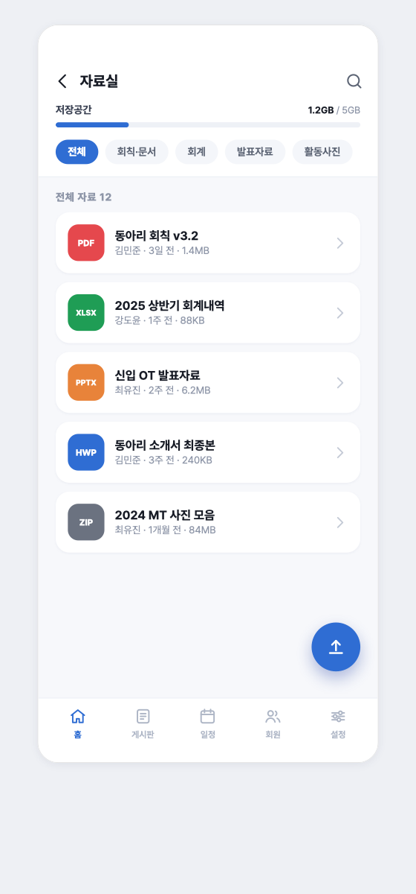

# damoim-server

**다모임 — 동아리 커뮤니티 플랫폼 백엔드 API 서버**

카카오 로그인 하나로 동아리를 만들고, 회원·기수·명부를 관리하고, 게시판·자료실·일정·구독까지 운영하는 멀티테넌트 SaaS형 동아리 플랫폼의 서버. [Damoim CMP 앱](https://github.com/rudtjr1106/damoim)(Compose Multiplatform, Android/iOS)의 실제 백엔드로, 클라이언트와의 경계는 전부 JSON 계약이다.

<p>
  
  
  
  
  
  
  
  
  
</p>

---

## 한눈에 보기

| 항목 | 규모 |
|---|---|
| REST 엔드포인트 | **95개** (컨트롤러 19개, 도메인 그룹 A~G) |
| 데이터 모델 | **테이블 37개 · JPA 엔티티 37개 · 리포지토리 37개** |
| 스키마 진화 | **Flyway V1~V7** (V1 전체 스키마 + V2~V7 무중단 증분) |
| 도메인 enum | **21종** (varchar + CHECK ↔ `@Enumerated(STRING)` 정합) |
| 인증 | 무상태 JWT(HS256) + 카카오 OAuth **서버측 재검증** + 리프레시 토큰 회전/재사용 탐지 |
| 인가 | deny-by-default + 동아리 스코프 RBAC(LEADER / STAFF 세분 권한) |
| 스토리지 | `StorageService` 추상화 → 로컬 디스크 ↔ **S3 presigned URL** 무경유 업/다운로드 |
| 배포 | Docker Compose(24/7) + Tailscale Funnel 고정 HTTPS, named volume 영속 |

> **한 줄 요약** — 카카오 OAuth 서버측 검증, IDOR 원천 차단, presigned 3단계 업로드, 플랜별 용량·정원 집행, 리프레시 토큰 회전까지 *적대적 보안 리뷰를 코드에 관철한* 백엔드.

---

## 기술 스택

| 구분 | 사용 기술 |
|---|---|
| 언어 / 런타임 | Kotlin 2.1.0, Java 17 (Temurin) |
| 프레임워크 | Spring Boot 3.4.1 (Web MVC · Data JPA · Security · Validation · Actuator) |
| 데이터베이스 | PostgreSQL 16, Spring Data JPA(Hibernate), **Flyway** 마이그레이션 |
| 인증 | jjwt 0.12.6 (자체 HS256 JWT), 카카오 OAuth 서버측 재검증 |
| 스토리지 | AWS SDK for Java v2 (S3, presigned URL) |
| 결제 검증 | Nimbus JOSE + JWT (Apple StoreKit 2 JWS · ES256 · x5c PKIX) |
| 하드닝 | Bucket4j + Caffeine(레이트리밋), 요청 본문 상한 필터, 보안 헤더 |
| 문서화 | springdoc-openapi 2.8.0 (Swagger UI / OpenAPI 3) |
| 빌드 / 배포 | Gradle 8.14, Docker(멀티스테이지), Tailscale Funnel |

---

## 구현 범위 — 도메인 그룹 A~G

CMP 앱 화면 그룹 A~G 전체의 서버 엔드포인트를 구현했다. 모든 그룹은 설계 시 적대적 보안 리뷰(IDOR·권한 상승·인코딩 경계)를 반영했다.

| 그룹 | 도메인 | 주요 엔드포인트 | 컨트롤러(엔드포인트 수) |
|---|---|---|---|
| **A** | 인증 · 계정 | 카카오 로그인→JWT 발급, 리프레시 회전, 로그아웃 / 프로필·프로필이미지·회원탈퇴 | AuthController(3), UserController(4) |
| **B** | 동아리 · 가입 | 동아리 생성/수정/전환, 가입코드 발급·제출, 가입신청 승인·거절 | ClubController(14), JoinController(3) |
| **C** | 게시판 | 홈 필독+피드, 글 CRUD, 첨부 업로드 URL, 좋아요·투표·댓글, 검색, 임시저장 | BoardController(8), BoardInteractionController(7), BoardDraftController(3), BoardSearchController(3) |
| **D** | 자료실(S3) | 자료 목록/상세, 저장공간 사용량, 3단계 업로드, 다운로드 URL+카운트 | ResourceController(7) |
| **E** | 회원 · 기수 · 프로필 | 명부, 기수/역할 변경, 내보내기, 동아리장 위임, 동아리별 표시이름 | MemberController(8) |
| **F** | 일정 · 이벤트 | 일정 CRUD, 조기마감·공지, 이벤트 신청/취소, 내 캘린더 토글 | ScheduleController(12) |
| **G** | 설정 · 구독 · 권한 · 차단 · 알림 · 신고 | 운영진 관리, 구독/플랜/인앱결제, 차단, 알림 설정·목록, 신고 접수 | AdminController(6), SubscriptionController(4), BlockedController(2), NotificationController(3), NotificationSettingsController(2), ReportController(3) |
| — | 인프라 | 헬스체크 핑 / 로컬 스토리지 파일 서빙(`provider=local`) | HealthController(1), LocalStorageController(2) |

> 전 엔드포인트는 서버 실행 후 **Swagger UI**(`/swagger-ui.html`)에서 탐색·시험 호출할 수 있다.

---

## 📱 이 API가 구동하는 화면

> 백엔드가 구동하는 [Damoim 앱](https://github.com/rudtjr1106/damoim)의 대표 화면(디자인 시안).
> 전체 화면 갤러리는 [클라이언트 레포](https://github.com/rudtjr1106/damoim)에 있습니다.

<table>
  <tr>
    <td align="center"><br><b>자료실</b><br><sub>S3 presigned 3단계 업로드</sub></td>
    <td align="center"><br><b>게시판</b><br><sub>글·댓글·투표·첨부 API</sub></td>
    <td align="center"><br><b>구독 플랜</b><br><sub>플랜별 한도 + 인앱결제 검증</sub></td>
  </tr>
</table>

---

## 아키텍처

### 패키지 구조 (도메인 지향)

```
src/main/kotlin/com/damoim/server/
├── DamoimServerApplication.kt      # 시작점
├── auth/                           # 카카오 OAuth 서버검증 · JWT 발급 · 리프레시 회전 · 세션 폐기
│   ├── AuthController · AuthService · KakaoClient · SessionRevoker
├── user/                           # /api/me 계정 · 프로필 · 회원탈퇴
├── club/                           # 동아리 · 가입코드 · 가입신청 · 멤버십 스코프 게이트
│   ├── ClubService · JoinService · MembershipService(인가 단일 지점) · JoinCodes
├── board/                          # 게시판(글·첨부·투표·모집·댓글·검색·임시저장)
├── resource/                       # 자료실(3단계 업로드 · 다운로드 · 저장공간)
├── member/                         # 명부 · 기수/역할 · 리더 위임
├── schedule/                       # 일정 · 이벤트 신청/정원
├── settings/                       # 운영진 권한 · 구독/플랜 · 차단 · 알림설정
├── notification/                   # 알림 생성(fan-out) · 조회
├── report/                         # 신고 접수/조회
├── billing/                        # 인앱결제 영수증 검증(App Store JWS · fail-closed)
├── storage/                        # StorageService 추상화(Local ↔ S3) · orphan 스윕
├── security/                       # JWT 필터 · 레이트리밋 · SecureRandom 토큰 · UserPrincipal
├── config/                         # SecurityConfig · WebFilterConfig · OpenApiConfig · SchedulingConfig
├── common/                         # 공통 응답 봉투 · 전역 예외 핸들러 · 라벨 유틸
├── web/                            # 헬스체크 · 요청 본문 상한 필터
└── domain/
    ├── entity/                     # JPA 엔티티 37개
    ├── enums/Enums.kt              # 도메인 enum 21종
    └── repository/                 # Spring Data 리포지토리 37개
src/main/resources/
├── application.yml / -local.yml / -prod.yml   # 환경변수 주입(코드는 로컬/운영 무수정)
└── db/migration/V1__init.sql … V7__…          # Flyway 스키마
```

### 핵심 설계 결정

**1. 공통 응답 봉투 + 전역 예외 은닉**
모든 응답을 `{ success, data, error{code, message} }`로 통일한다(`ApiResponseWrapper`가 컨트롤러 DTO를 자동 래핑, 이중 래핑 방지). 전역 `GlobalExceptionHandler`가 검증 실패→400, 낙관적 락/무결성 위반→409, 카카오 장애→502, 스토리지 오류→502로 매핑하고 내부 스택·원인은 로그로만 남긴다. 인증/인가 실패도 HTML 리다이렉트가 아니라 **필터 레벨에서 봉투 JSON 401/403**으로 직접 응답한다.

**2. IDOR 원천 차단 (인가 단일 지점)**
동아리·리소스 소유 판정을 `path`/`body` 같은 클라 입력이 아니라 **검증된 JWT의 `userId`로만** 시작한다. 활성 동아리(`activeClubId`)는 JWT 클레임이 아니라 **서버가 소유·관리하는 세션 상태**(`users.active_club_id` 컬럼)로, `MembershipService`가 `userId`로 조회하며 `switchClub`으로만 바뀐다. 모든 인가 헬퍼(`currentMembership`, `requireLeader`, `requirePermission`)를 `MembershipService` 한 곳으로 모아, 요청자가 조작할 수 있는 식별자로 남의 리소스에 접근하는 경로 자체를 없앴다.

**3. no-ORM-그래프 데이터 모델**
엔티티 37개 전부 FK를 `@ManyToOne`이 아닌 **스칼라 `Long` 컬럼**으로 들고(연관관계 애노테이션 0건), 관계는 리포지토리 명시 쿼리로 해석한다. `likeCount`·`memberUsed`·`readRate` 같은 파생값은 컬럼화하지 않고 `COUNT`로 계산한다 → **N+1·lazy 초기화 함정을 원천 차단**하고 정규화 원칙을 코드까지 관철했다.

**4. presigned URL 3단계 업로드**
클라이언트가 서버 바이트를 경유하지 않고 스토리지에 직접 업/다운로드한다: `POST …/upload-url`(권한·쿼터 예비검증 후 presigned PUT 발급) → 클라가 스토리지에 **직접 PUT** → `POST …/`(등록). 등록 단계에서 클라가 선언한 크기를 신뢰하지 않고 **실제 오브젝트 크기를 재검증**(S3 `HeadObject`)한 뒤, 동아리 행 비관적 락 아래에서 쿼터를 집행한다.

---

## 데이터 모델

**PostgreSQL 16 / JPA(Hibernate) / Flyway**. `V1__init.sql` 하나가 37개 테이블을 FK 위상정렬 순서로 생성하고, `V2`~`V7`은 신규 테이블 없이 순수 증분(시드/컬럼 추가)만 한다. Hibernate `ddl-auto=validate` — **스키마 변경은 Flyway가 전담**, Hibernate는 검증만.

| 버전 | 내용 |
|---|---|
| **V1** | init — 37개 테이블 전체(Identity/Auth, Club/Cohort, 게시판, 일정/이벤트, 자료실, 구독/운영진/알림) + 인덱스·CHECK·FK 커버링 인덱스 |
| **V2** | 구독 플랜 카탈로그 시드(FREE / STANDARD / PRO + plan_features) |
| **V3** | 실제 S3 연동 — `storage_key`/`link_url` 컬럼 + 첨부 타입별 CHECK 재정의, 프로필 이미지 키 |
| **V4** | 동아리 대표 이미지 키(`clubs.image_key`) |
| **V5** | 알림 다형 이동대상(`target_type`/`target_id` + XOR CHECK) |
| **V6** | 플랜별 저장 용량(FREE 1GB / STANDARD 20GB / PRO 100GB) + 구독 스냅샷 컬럼 |
| **V7** | 동아리별 표시 이름/사진 오버라이드(`club_members.display_name`) |

**적용된 실무 패턴**
- **enum ↔ DB CHECK ↔ `@Enumerated(STRING)` 3중 정합** — enum name이 CHECK 값과 1:1 일치하도록 규약화, ordinal 드리프트 방지
- **다형성의 관계형 표현** — 첨부(Image/File/Link)는 `type + nullable + CHECK` single-table, 알림 이동대상은 FK 없는 다형 참조 + XOR CHECK
- **스냅샷 컬럼** — `subscriptions.member_limit`/`storage_quota_bytes`, `payment_records.title`을 계약·결제 시점 값으로 고정 → 플랜 개정에도 과거 이력이 오라벨되지 않음
- **부분 유니크 인덱스** — 활성 가입코드만 유일, `PENDING` 신청만 중복 차단 등 비즈니스 유일성을 `WHERE`절 인덱스로 정밀 표현
- **소프트 delete** — 게시글·댓글·자료는 참조 이력 보존을 위해 `deleted_at`
- **Postgres FK 무인덱스 이슈 대응** — FK 컬럼 커버링 인덱스 5개 수동 추가

---

## 인증 · 보안

**무상태 JWT + 카카오 OAuth 서버측 재검증 + 동아리 스코프 RBAC.** 적대적 보안 리뷰가 코드·주석에 일관되게 반영돼 있다.

**카카오 OAuth 2단계 재검증** — 클라가 보낸 카카오 access token을 서버가 (1) `access_token_info`로 **토큰 발급 대상 앱(app_id)이 우리 앱인지** 확인(confused-deputy / 타 카카오앱 토큰 재사용 차단), (2) `user/me`로 프로필 조회한다. 클라의 신원 주장을 신뢰하지 않는다. 카카오 호출에는 connect 2s / read 3s 타임아웃을 걸어 비인증 엔드포인트에서의 워커 고갈을 막는다.

**자체 JWT + 리프레시 토큰 보안**
- HS256, 액세스 TTL 30분 / 리프레시 14일. 시크릿이 없으면 **운영은 부팅 실패(fail-fast)**, 비운영은 재시작마다 무효화되는 임시 랜덤 키 → 커밋된 알려진 키가 없어 위조 불가
- 리프레시 토큰은 `SecureRandom` 256비트로 발급하고 DB에는 **SHA-256 해시만** 저장(평문 금지)
- `refresh()`는 **원자적 회전 + 재사용 탐지** — 폐기된 토큰이 다시 제시되면 탈취로 간주해 `REQUIRES_NEW` 별도 트랜잭션으로 **전 세션을 강제 폐기**(401 롤백에도 폐기는 독립 커밋)

**deny-by-default 인가** — `SecurityConfig`는 무상태(`STATELESS`), `anyRequest → authenticated`. 명시된 공개 경로만 화이트리스트. 컨트롤러 95개 엔드포인트 중 무인증은 6개뿐, 나머지 89개는 JWT Bearer 필수.

**동아리 스코프 RBAC** — `MembershipService`가 ACTIVE 회원만 통과시키고, LEADER 전용 액션과 운영진(STAFF) 세분 권한(`requirePermission`)으로 운영 액션을 게이팅한다. 운영진 부여는 `club_members.member_role`을 단일 진실원으로 함께 갱신한다.

**하드닝 필터 체인**
- **레이트리밋**(Bucket4j + Caffeine) — 인증/가입/글작성/업로드/검색/구독 등 민감 엔드포인트에 USER 키(미인증은 IP 폴백)로 버킷 적용, 초과 시 429
- **요청 본문 상한**(1MB) — 본문 읽기 전 `Content-Length`로 413 조기 응답
- **보안 헤더** — HSTS(1년, includeSubDomains), Referrer-Policy, X-Frame-Options DENY, X-Content-Type-Options nosniff
- **경로 탈출 방어** — 스토리지 키를 퍼센트 디코딩 후 화이트리스트 정규식 + `normalize`/`startsWith(root)` 2중 검증

---

## 파일 스토리지

`StorageService` 인터페이스 하나로 스토리지를 추상화하고, Spring `@ConditionalOnProperty(app.storage.provider)`로 구현을 부팅 시 택일한다.

| provider | 구현 | 용도 |
|---|---|---|
| `local` (기본) | `LocalStorageService` | AWS 의존성 0으로 로컬 디스크에 저장·서빙 — 자가호스팅(Tailscale 신뢰망) 기본값 |
| `s3` | `S3StorageService` | 운영 권장 — presigned PUT/GET(**서명·만료 URL**), `HeadObject` 크기 재검증, `ListObjectsV2` 페이지네이션 |

**환경변수(`STORAGE_PROVIDER`)만 바꾸면 코드 무수정으로 전환**된다. 인터페이스의 `verifiesSize` 플래그로 크기 검증 가능 여부까지 추상화했다.

> `local` provider의 파일 서빙(`/_localstorage`)은 S3와 달리 서명·만료 없는 경로 기반 접근이라, 현재는 Tailscale 신뢰망 뒤 자가호스팅을 전제로 한다. 신뢰망 밖 다중 사용자 운영에는 `STORAGE_PROVIDER=s3`(서명·만료 presigned)를 권장한다 — 로드맵 참조.

- **쿼터·정원 집행** — `SubscriptionService.effectiveLimits()`가 구독 스냅샷 + 해지 만료 지연평가로 실효 한도를 산출하고, 저장 용량과 회원 정원이 **같은 실효 한도 판정을 공유**한다. **자료 업로드 쿼터·이벤트 신청 정원**은 동아리/이벤트 행 비관적 락(`findByIdForUpdate`)으로 감싸 동시 요청의 TOCTOU 초과를 직렬화한다.
- **키 소유권 검증** — 오브젝트 키는 도메인 프리픽스(`resources/{clubId}/…`)로 생성하고 ASCII-only sanitize한다. 등록 시 `req.storageKey`가 요청자 동아리 프리픽스로 시작하지 않으면 거절 → 크로스테넌트 참조 차단.
- **결제 검증(fail-closed)** — App Store JWS를 x5c 체인부터 설정된 Apple 루트 CA까지 PKIX로 검증(ES256 서명 + bundleId/productId 클레임 확인). dev에선 토글로 통과, 운영에선 강제.
- **S3 orphan 스윕** — presigned PUT 후 미등록으로 남은 고아 오브젝트를 주기 배치로 회수. 판정 로직을 순수 함수(`OrphanSweepPlanner`)로 분리해 테스트 용이, grace 유예로 등록 대기분 오삭제 방지.

---

## API 문서 (Swagger UI / OpenAPI 3)

서버 실행 후:

- **Swagger UI** — <http://localhost:8080/swagger-ui.html> — 전 엔드포인트(A~G) 탐색·시험 호출
- **OpenAPI 스펙(JSON)** — <http://localhost:8080/v3/api-docs>

인증이 필요한 요청은 우측 상단 **Authorize**에 JWT 액세스 토큰(`POST /api/auth/kakao` 응답)을 넣으면 자동 적용된다. 모든 응답은 공통 봉투 `{ success, data, error }`로 감싸지며, Swagger에 표기된 스키마는 `data` 필드의 내용이다.

> 운영에서 문서 노출을 끄려면 `application-prod.yml`에 `springdoc.api-docs.enabled: false`, `springdoc.swagger-ui.enabled: false`를 추가한다.

---

## 빌드 · 실행 (로컬)

```bash
# 1) PostgreSQL 띄우기 (빈 DB)
docker compose up -d

# 2) 서버 실행 — 부팅 시 Flyway가 V1~V7을 적용해 37개 테이블 자동 생성
./gradlew bootRun

# 3) 확인
curl http://localhost:8080/api/ping         # {"service":"damoim-server","status":"ok",...}
curl http://localhost:8080/actuator/health   # {"status":"UP"}

# 생성된 테이블 확인
docker exec damoim-postgres psql -U postgres -d damoim -c "\dt"   # 37 rows
```

`.env.example`를 `.env`로 복사해 사용한다. **`.env`·시크릿은 커밋 금지**(`.gitignore` 처리됨).

### 설정 (환경변수 주입 — 코드는 로컬/운영 무수정)

| 변수 | 기본값 | 설명 |
|---|---|---|
| `SPRING_PROFILES_ACTIVE` | `local` | `local` / `prod` |
| `DB_URL` / `DB_USERNAME` / `DB_PASSWORD` | 로컬 docker 기준 | DB 접속(운영은 시크릿) |
| `JWT_SECRET` | (비움) | HS256 서명 키. 운영 필수·최소 32바이트, 미주입 시 부팅 실패 |
| `KAKAO_APP_ID` | `0` | 카카오 앱 ID(숫자). 미주입 시 부팅 실패 |
| `STORAGE_PROVIDER` | `local` | `local`(디스크) / `s3` |
| `S3_BUCKET` / `S3_REGION` | — | provider=s3일 때 사용(자격증명은 AWS 기본 체인/IAM 역할) |
| `BILLING_VERIFY` | `false` | 인앱결제 영수증 재검증(운영=true, fail-closed) |

---

## 배포

집에 남는 PC에서 **DB + 서버를 Docker Compose로 24/7 구동**하고, **Tailscale Funnel**로 무료 고정 HTTPS 주소를 받아 폰이 어느 망에서든 접속하게 한다. 도메인·포트포워딩·인증서 불필요.

```
[폰/에뮬] → https://<host>.<tailnet>.ts.net → Tailscale(집PC) → localhost:8080 → app → postgres
```

```bash
# 최초 배포
cp .env.prod.example .env         # DB_PASSWORD · JWT_SECRET · KAKAO_APP_ID 채우기
docker compose -f docker-compose.prod.yml up -d --build
tailscale funnel --bg 8080        # 고정 HTTPS 주소 발급(재부팅 자동 유지)

# 코드 업데이트 후 재배포
git pull && docker compose -f docker-compose.prod.yml up -d --build
```

- **멀티스테이지 Dockerfile** — `temurin:17-jdk`로 `bootJar` 빌드 → `temurin:17-jre`로 실행
- **영속성** — 업로드 바이트(`damoim-storage`)와 Postgres 데이터(`damoim-pgdata`)를 named volume으로 보존, `restart: always`로 재부팅 자동 복구
- **AWS 이식** — 동일 이미지에 `SPRING_PROFILES_ACTIVE=prod` + RDS 엔드포인트 + `STORAGE_PROVIDER=s3`만 주입하면 코드 변경 없이 확장

자세한 절차는 [DEPLOY.md](./DEPLOY.md) 참고.

---

## 로드맵

- [ ] 운영 스토리지 기본값을 S3 presigned로 전환(로컬 서빙 경로 서명·만료 URL 도입)
- [ ] 통합 테스트 커버리지 확대(현재 스키마/엔티티/서비스 단위 검증 중심)
- [ ] Google Play 인앱결제 영수증 검증(App Store JWS 검증은 구현 완료)
- [ ] 알림 실시간 전달(현재 pull 기반) — 푸시/웹소켓 채널
- [ ] 관측성 강화(구조화 로깅 · 메트릭 · 트레이싱)

---

<sub>개인 프로젝트 · 단독 설계 및 구현. 클라이언트([Compose Multiplatform](https://github.com/rudtjr1106/damoim))부터 서버·DB·배포까지 풀스택으로 담당했다.</sub>
